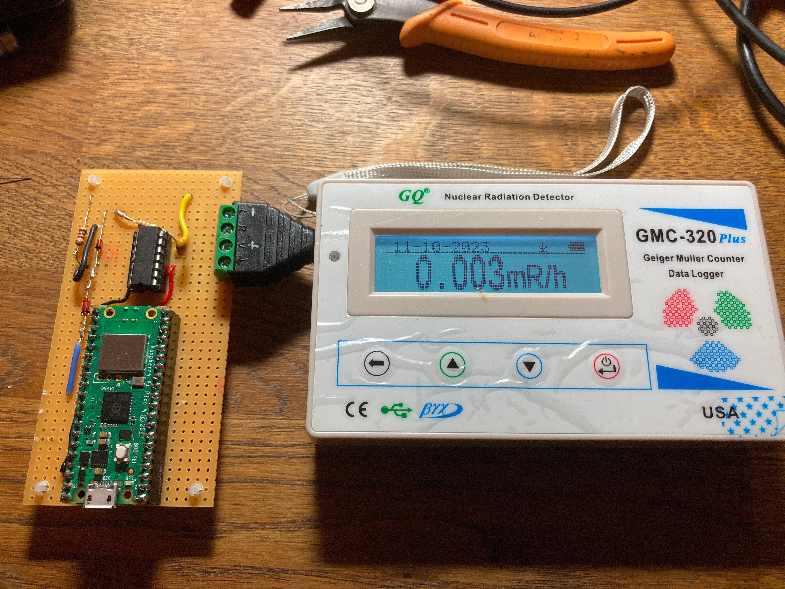
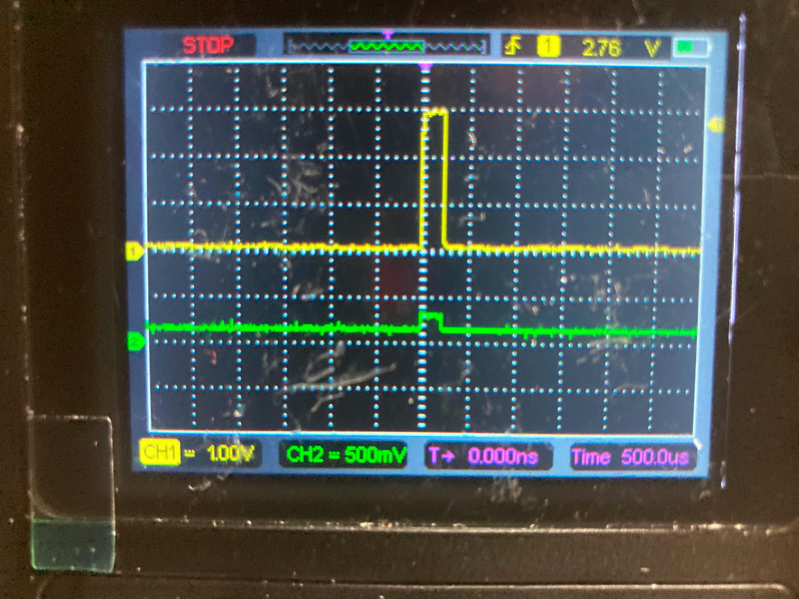
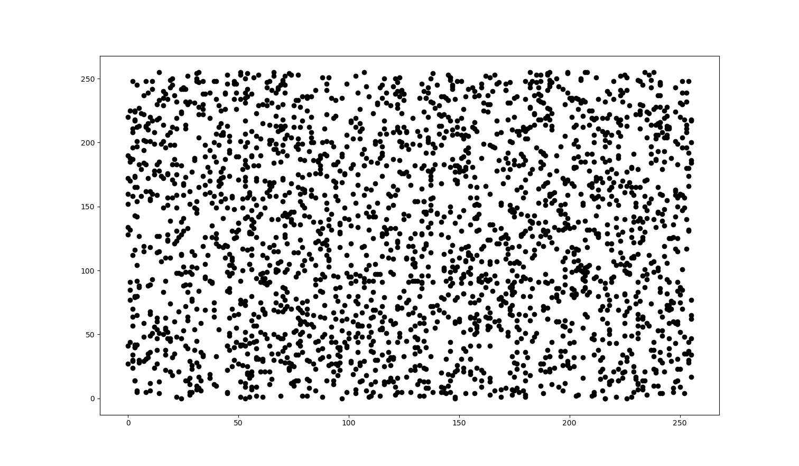
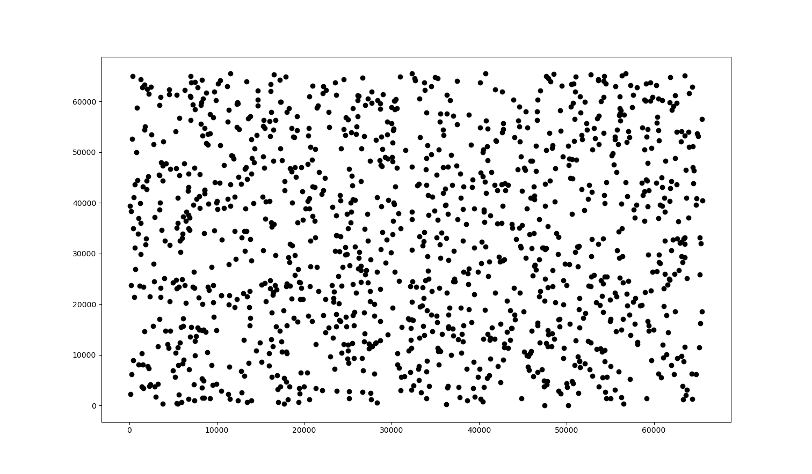

Introduction:
=============

This project permits the creation of RNG generators based on nuclear decay,  interfacing  a Geiger counter with audio exit to a MC. It's an evolution of my previous project you find here:

[NuclearRNG](https://github.com/gbonacini/nuclear_random_number_generator)

Theoretically it permits the conversion of any Geiger with audio feedback to an RNG in fact, differently from its predecessor, this appliance doesn't use exotic hardware but standard Geiger counters. A Raspberry Pico W is employed as microcontroller platform.



Hardware:
=========

* A Raspberry Pico (RP2040) is employed as microcontroller platform;
* An OpAmp based circuit raises the audio signal level of the Geiger "pulses" captured using the audio jack:



Algorithm and Features:
=======================

* Two thread are in execution : one for Geiger pulses sampling, another to provide RNGs via socket;
* In the main loop, a register is cyclically increased from 0 to 15, when it reaches 15 is reset to 0. When a particle is detected, the current value is stored in queue ready to be deployed on request;
* Default queue length is 10240 bytes.

Protocol:
=========

* When a socket connects to the appliance via WIFI, a message with the following format is given as response:
```shell
ready\n
```
<sp><sp><sp>where '\n' is "newline" character
* You require a RN sending the message:
```shell
req
```
* Then you'll receive a RN in an answer with the following format:
```shell
<random_number><separator><generator_number><separator><available_numbers><newline>
```
<sp><sp><sp>where:
  - the first field is a random number in the range 0-15 or the number 16 if an error was generated or no number is available yet;
  - the chosen range is 0-15 is convenient because the union of two generated random numbers represent a full random byte;
  - the second field represent the original value of the register incremented in loop to extract the random number using module operator of integer division by the specific range (0-15), it's provided as safeguard to verify that the loop cover every possible value for a given event frequency;
  - the separator is the character ':';
  - then a field with an integer telling you how many RNs are available in the appliance buffer, ready to be requested;
  - a newline ( '\n' ) ends the message.
* Example:
```shell
52:3473460:1384\n
```

* You can terminate the connection with the command:
```shell
end
```
* At the moment, concurrent access is not supported (aka I don't need it for now), so, closing the connection also permits different client to connect;

Dependencies:
=============

* Raspberry Pi Pico SDK
* Cmake

Detailed instruction for dependencies installation are available on Raspberry website.

Configuration:
==============

* Before compiling, is required to edit wifi_credential.hpp inserting Wifi SSID and password.

Installation and Use:
=====================

- compile the program as follow (set -DPICO_SDK_PATH using real pico-sdk path):
```shell
  cd build
  make -f makefile.srv all
```
- deploy the generated binary file named:
```shell
geiger_gen2.uf2 
```
  putting the Pico in "deploy mode" pushing the white button before connecting USB cable and releasing the same button a second after the connection.
- A trivial Python client example is present in "test" directory in the present software distribution.
- The number can be requested from any program able to create Berkeley sockets using the described protocol.

Tests:
======

- 'test' directory contains test results and tools to perform the  tests themselves;
- Python3 and some dependencies are required;
- Ent suit is required:
```shell
apt-get install ent
```
- A makefile is present, to perform the test use the following:
```shell
make -f makefile clean all
```
- A file with 250'000 and RNs and another file with 10'000 RNs extracted from the bigger one are provided.

Results:
========

- Preliminary tests gave good results:

<BR>

- Ent suite:
```shell
Entropy = 7.998604 bits per byte.

Optimum compression would reduce the size
of this 125000 byte file by 0 percent.

Chi square distribution for 125000 samples is 241.57, and randomly
would exceed this value 71.76 percent of the times.

Arithmetic mean value of data bytes is 127.6767 (127.5 = random).
Monte Carlo value for Pi is 3.135794173 (error 0.18 percent).
Serial correlation coefficient is 0.002606 (totally uncorrelated = 0.0).
```
